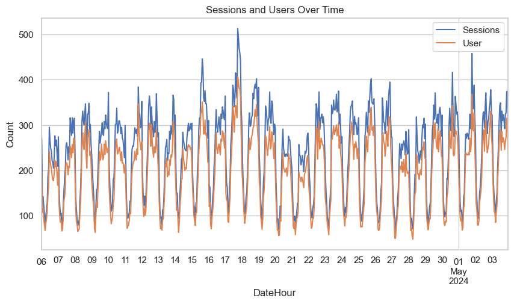

# 📊 Website Traffic & Engagement Analysis

This project explores real-world website analytics data to uncover trends in user behavior, marketing channel performance, and overall engagement. Using Python and data visualization libraries, it aims to answer key business questions about how users interact with a website.

---

## 📁 Project Structure
Website-Traffic-Analysis/
├── data/
│ └── dataset.csv
├── notebooks/
│ └── website_traffic_analysis.ipynb
├── README.md


---

## 🎯 Key Business Questions Addressed

1. **What patterns or trends can you observe in website sessions and users over time?**
2. **Which marketing channel brought the highest number of users to the website, and how can we use this insight to improve traffic from other sources?**
3. **Which channel has the highest average engagement time, and what does that tell us about user behavior and content effectiveness?**
4. **How does engagement rate vary across different traffic channels?**
5. **Which channels are driving more engaged sessions compared to non-engaged ones, and what strategies can improve engagement in underperforming channels?**
6. **At what hours of the day does each channel drive the most traffic?**
7. **Is there any correlation between high traffic (sessions) and high engagement rate over time?**

---

## 📌 Key Insights

- 📈 **Direct and Organic channels** brought in the highest traffic.
- ⏱️ **Average engagement time** varied significantly across channels, indicating content effectiveness.
- 📊 **Engagement rate distribution** helped identify underperforming channels.
- ⏰ **Heatmaps** showed peak user activity hours.
- 📉 **Correlation analysis** revealed how engagement and sessions align over time.

---

## 🛠️ Tools & Technologies

- Python
- Pandas
- NumPy
- Matplotlib
- Seaborn
- Jupyter Notebook

---

## 📷 Sample Visualizations

**
**
*

---

## ▶️ How to Run

1. Clone the repository:
   ```bash
   git clone https://github.com/shubhamchaurasiya12/Website_Data-Analysis
   cd Data Analytics Projects

2. Open the notebook:
    jupyter notebook notebooks/website_traffic_analysis.ipynb
